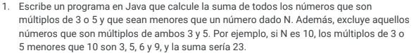

# RETO 1 📜

## PUNTOS A REALIZAR 

### Punto 1 

### Punto 2

### Punto 3

### Punto 4

**Explicacion del algoritmo punto 4:**

Este algoritmo sirve para generar los primeros 10 nemuros de la serie fibonacci en cada iteracion del bucle for  se imprime el valor de a, se guarda el valor actual de a en una variable temporal, se actualiza el valor de a con el valor de b y se actualiza el valor de b sumando el valor temporal al valor anterior de b.

## CONSTRUIDO CON 🛠️

- JAVA - Lenguaje de programacion 
- NETBEANS - IDE para codigo de JAVA
- NOTION - Para la generacion del readme 

## AUTOR ✒️

⌨️ con ❤️ por [Santiago24x](https://github.com/Santiago24x) 🤙
